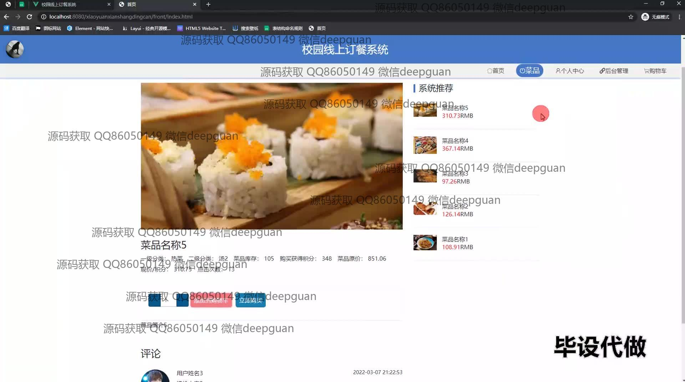
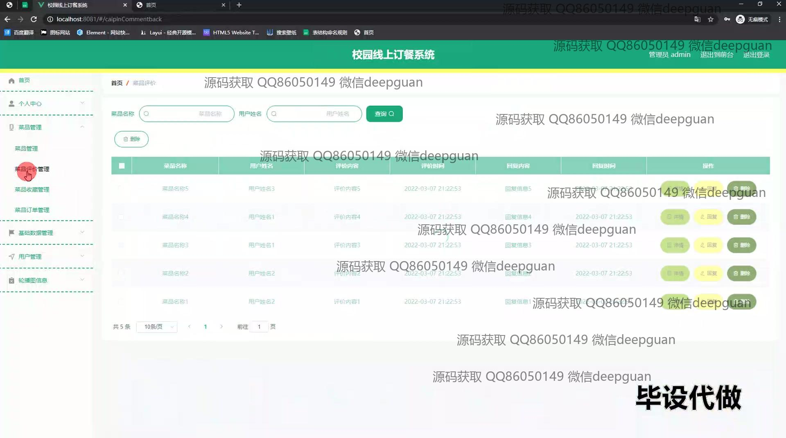
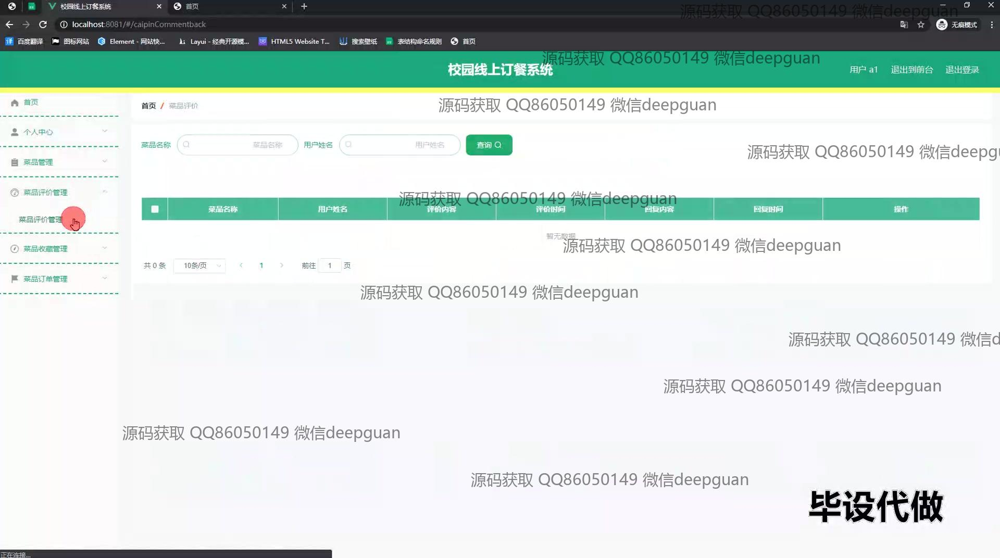

<h1 align="center">校园线上订餐系统的设计与实现+vue</h1>

## 简介
校园线上订餐系统：角色分为管理员和用户；实现用户信息管理、订单管理、菜品浏览与购买、会员等级管理等功能。采用SSM框架和Vue前端技术，界面简洁，用户体验佳。    --计算机毕业设计源码；毕设源码；java毕业设计源码

## 联系方式

<h3 align="center">获取完整代码与数据库文件 + 微信：deepguan QQ: 86050149 QQ群: 783742310</h3>

<h3 align="center">可帮忙远程部署 包运行成功！提供远程部署、修改代码、设计文档指导、代码讲解等服务！</h3>

## 功能介绍（完整见运行截图）
管理员： 基本功能包括登录、注册和注销。可通过导航菜单访问基本数据管理、分类管理、学院管理和用户管理等模块。支持用户账户管理、订单管理、商品管理，以及会员等级管理，提供查看、修改、删除、新增等操作。系统支持根据会员等级在用户支付时累计积分并结算时按折扣规则计算金额，帮助高效进行校园订餐数据的维护和管理。

用户： 用户可登录、查看和修改个人信息，如学号、姓名、手机号、身份证号、学院、班级、邮箱、余额、积分和性别，支持上传或修改头像。可以通过系统浏览和选择菜品，添加到购物车或立即购买，通过该功能提交订单或取消操作。用户界面包括查看和管理购物车、订单明细及进行订单支付或退单操作，可根据需要进行充值以确保账户正常使用。

## 运行截图

本代码来源于网络,仅供学习参考使用!

